# 🔄 Docto — Application Flow

> **Version:** 1.0  
> **Last Updated:** June 8, 2026  
> **Status:** Draft

---

## High-Level System Flow

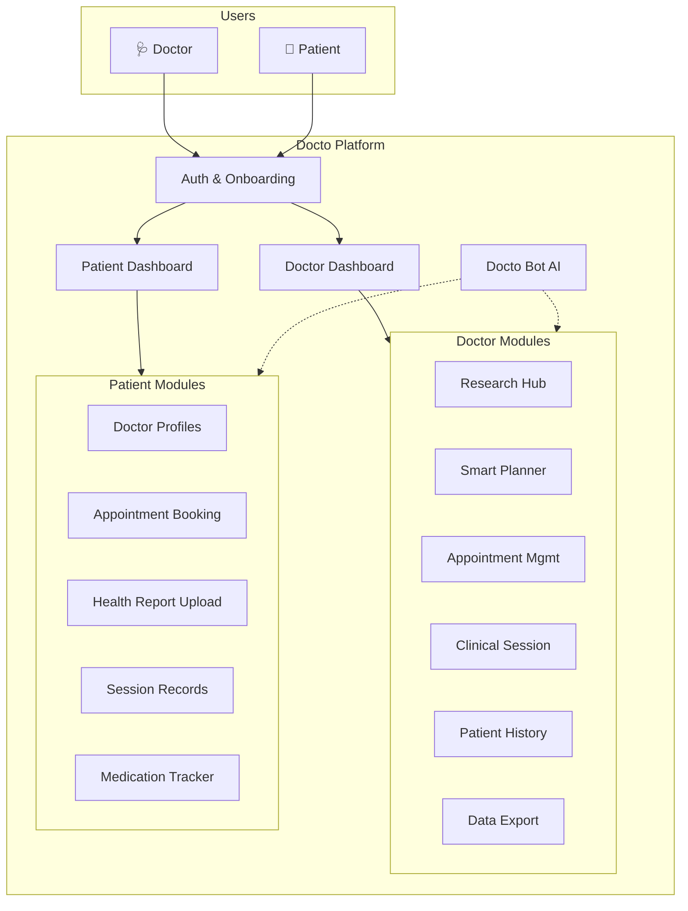

---

## 1. Authentication & Onboarding Flow

### 1.1 Doctor Registration

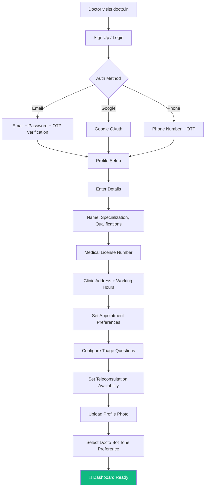

### 1.2 Patient Registration

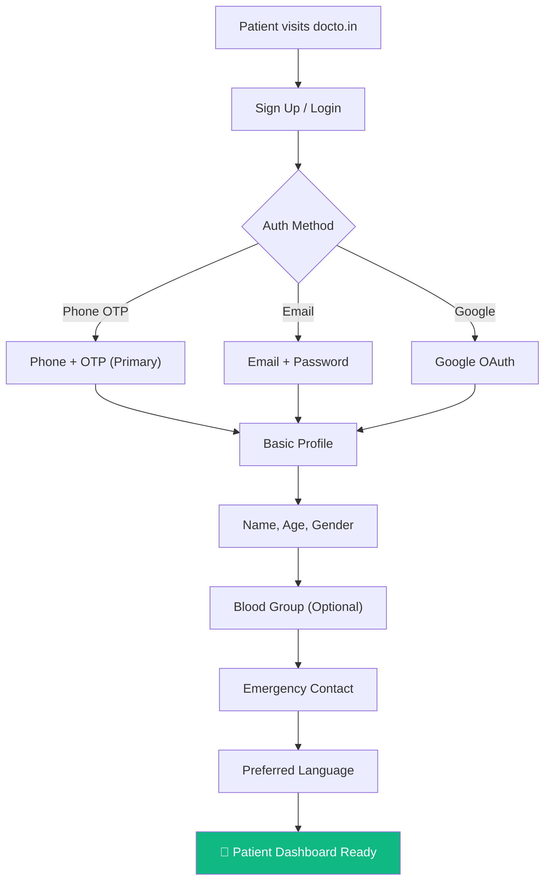

---

## 2. Doctor Research Hub Flow

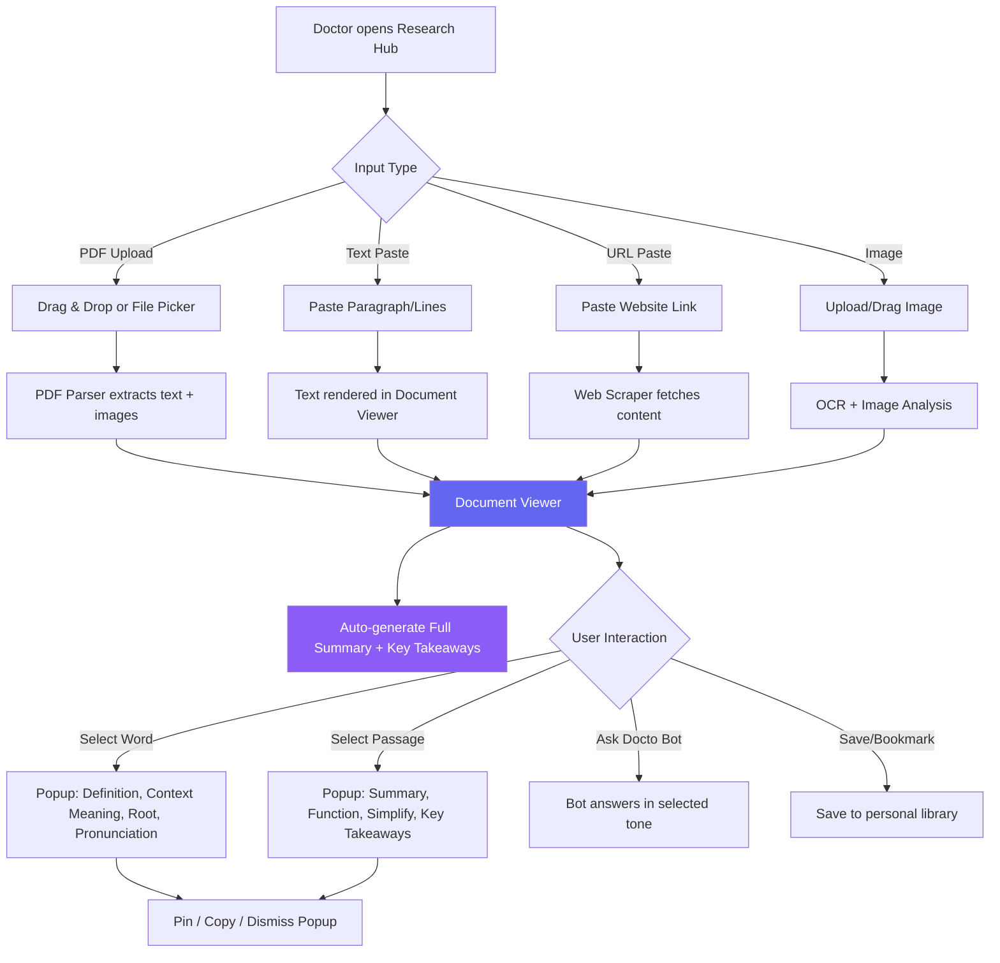

---

## 3. Docto Bot Interaction Flow

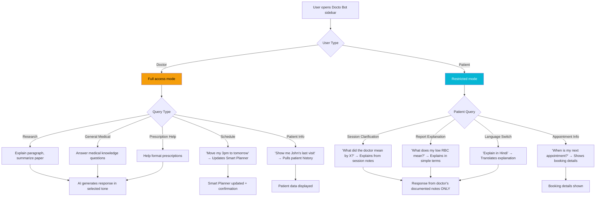

---

## 4. Smart Planner Flow

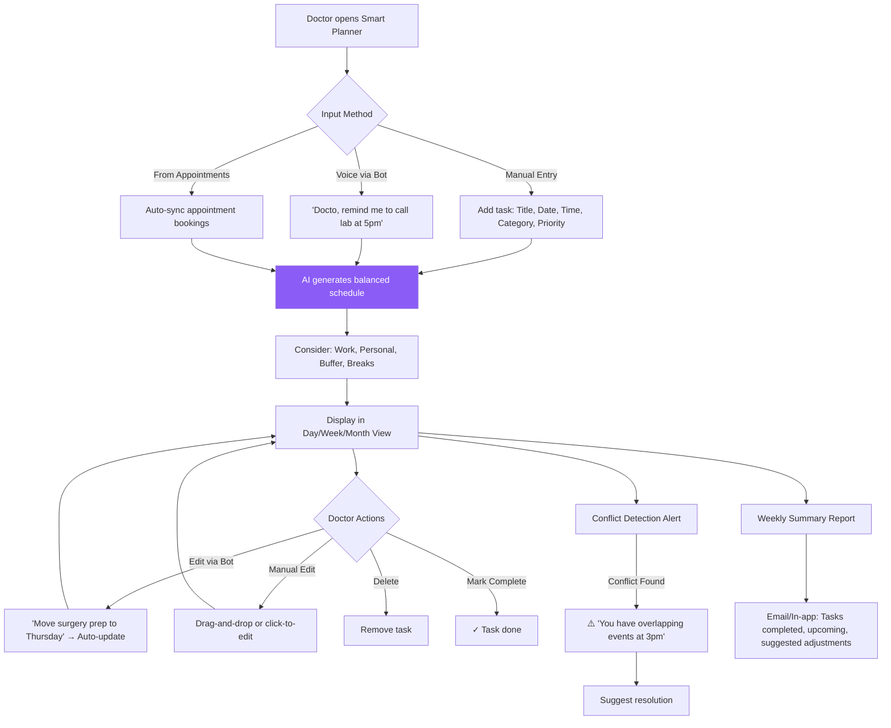

---

## 5. Appointment Management Flow

### 5.1 Doctor Side — Configuration & Management

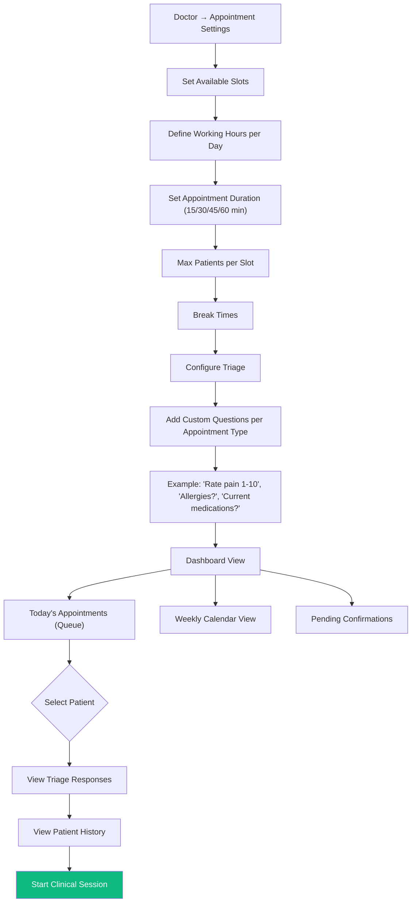

### 5.2 Patient Side — Booking

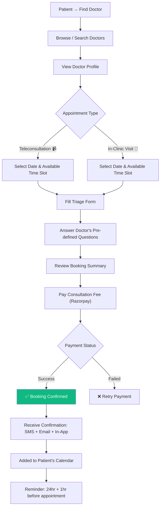

---

## 6. Clinical Session Flow (Core Feature)

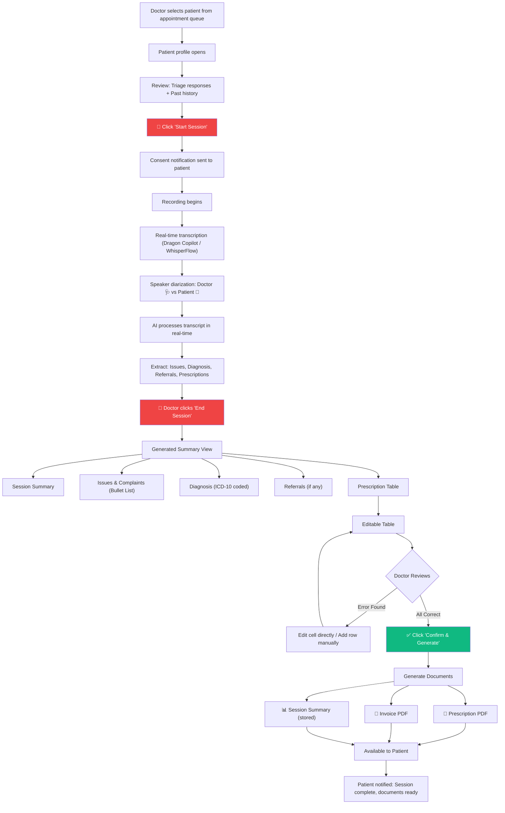

### Prescription Table Detail

```
┌────┬──────────────────┬──────────┬───────────────────┬──────────┬────────────┬──────────┬──────────────────────┐
│ #  │ Medicine Name     │ Dosage   │ When to Take      │ Timing   │ Meals      │ Duration │ Notes                │
├────┼──────────────────┼──────────┼───────────────────┼──────────┼────────────┼──────────┼──────────────────────┤
│ 1  │ Amoxicillin 500mg│ 1 cap    │ Morning, Afternoon│ 8am, 2pm │ After meals│ 7 days   │ Take with warm water │
│    │                  │          │ Night             │ 9pm      │            │          │                      │
├────┼──────────────────┼──────────┼───────────────────┼──────────┼────────────┼──────────┼──────────────────────┤
│ 2  │ Paracetamol 650mg│ 1 tablet │ As needed         │ Max 3/day│ Any        │ 5 days   │ Only if fever >100°F │
├────┼──────────────────┼──────────┼───────────────────┼──────────┼────────────┼──────────┼──────────────────────┤
│ 3  │ [Doctor adds row]│          │                   │          │            │          │                      │
└────┴──────────────────┴──────────┴───────────────────┴──────────┴────────────┴──────────┴──────────────────────┘
         ✏️ Click any cell to edit                                              [+ Add Medicine] [✅ Confirm]
```

---

## 7. Patient Health Report Analysis Flow

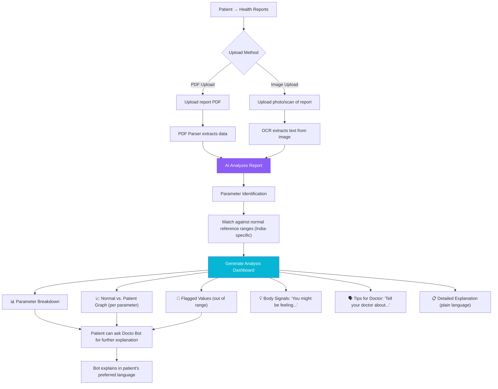

---

## 8. Medication Tracker & Gamification Flow

```mermaid
flowchart TD
    A["Session ends → Prescription generated"] --> B["Auto-create medication schedule"]
    B --> C["Calendar view: Daily timeline of medications"]
    
    C --> D["Push notification: 'Time to take Amoxicillin!'"]
    D --> E{"Patient Action"}
    
    E -->|Mark Done ✅ (within ±30 min)| F["✅ Recorded on time"]
    E -->|Mark Done ⏰ (late)| G["⚠️ Recorded late — streak in danger"]
    E -->|Missed ❌| H["❌ Missed — streak broken"]
    
    F --> I["Streak continues! 🔥"]
    G --> J["Warning: 'Close call! Next time be on time 😬'"]
    H --> K["Streak reset 💀 'RIP your discount coupon 🪦'"]
    
    I --> L{"Streak Milestones"}
    L -->|7 days| M["🏆 'ONE WEEK CHAMPION!' + Discount unlocked"]
    L -->|14 days| N["💎 'TWO WEEK WARRIOR!' + Better discount"]
    L -->|30 days| O["🎊 'LEGENDARY! 30 DAYS!' + Special reward"]
    
    M --> P["Discount applicable on next booking"]
    N --> P
    O --> P
    
    K --> Q["Discount coupon revoked"]
    
    style F fill:#10b981,color:#fff
    style H fill:#ef4444,color:#fff
    style O fill:#f59e0b,color:#000
```

---

## 9. Data Export Flow

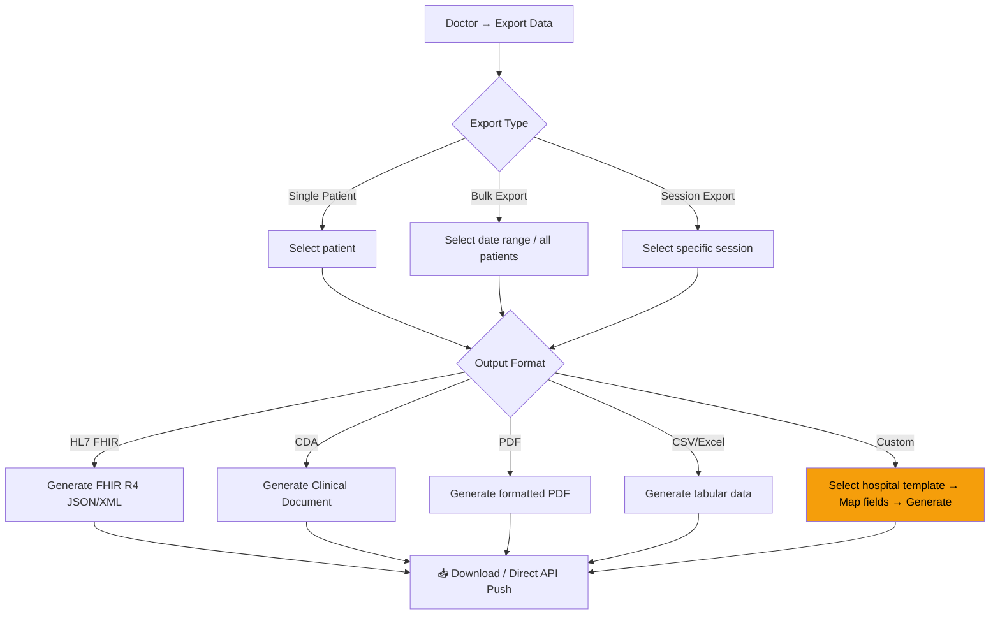

---

## 10. Notification Flow

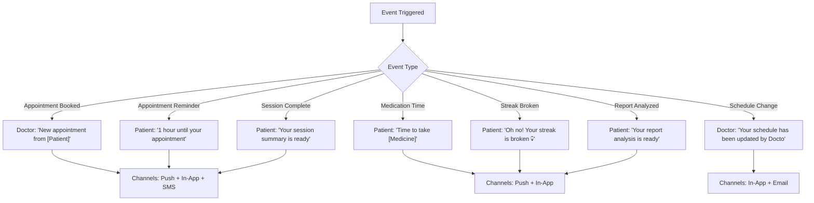

---

## 11. Complete User Journey — End to End

### Doctor's Day

```
Morning:
  📱 Open Docto → Check Smart Planner for today's tasks
  📋 Review upcoming appointments + patient triage responses
  📚 Quick research: Upload a new paper → Read with AI assistance

Clinic Hours:
  🏥 Patient arrives → Select from queue → Review history
  🔴 Start Session → Talk naturally → AI transcribes everything
  🔴 End Session → Review prescription table → Fix any errors
  ✅ Confirm → PDFs generated → Patient notified
  ↻ Repeat for next patient

Evening:
  🤖 "Docto, move tomorrow's 3pm to 4pm" → Schedule updated
  📊 Review weekly summary → Plan next week
  📤 Export patient data for hospital records
```

### Patient's Journey

```
Discovery:
  🔍 Search for doctor → View profile → Book appointment
  📝 Fill triage form → Pay → Receive confirmation

Before Appointment:
  📤 Upload recent blood work → View AI analysis
  💡 "Your iron is low — tell your doctor about fatigue"

During Appointment:
  📹 Join telecall or visit clinic → Session recorded
  🤖 AI processes everything in real-time

After Appointment:
  📄 View prescription PDF → See invoice → Read summary
  📅 Medication calendar auto-created with reminders
  ✅ Take meds on time → Build streak → Earn discounts

Ongoing:
  🤖 Ask Docto Bot: "What did the doctor mean by hypertension?"
  📊 Track medication compliance → Stay motivated
```

---

> 📌 **This document maps every major user interaction. Use it as a reference when building each feature module.**
