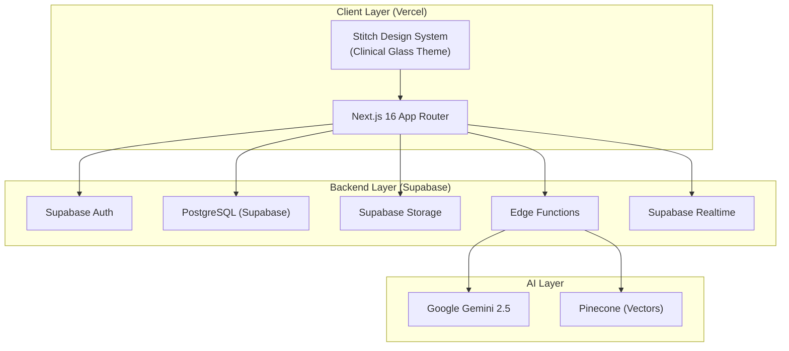

# 🏥 Docto — MedFlow Clinical Suite: Development Roadmap

> **Project:** Docto (MedFlow Clinical Suite)  
> **Created:** June 8, 2026  
> **Stack:** Next.js 16 + TypeScript + Supabase + Vercel  
> **Design Source:** [Google Stitch — MedFlow Clinical Suite](https://stitch.withgoogle.com/projects/18353798320146917734)  
> **Agent Patterns:** [ECC (affaan-m/ECC)](https://github.com/affaan-m/ECC)

---

## Architecture Overview



---

## Key Integration Points

| Integration | Tool/MCP | Purpose |
|---|---|---|
| **Database** | Supabase MCP | Schema creation, migrations, RLS policies, SQL execution |
| **UI Design** | Google Stitch MCP | Screen designs, design system tokens, HTML code extraction |
| **Agent Patterns** | ECC (GitHub repo) | Coding standards, review agents, TDD patterns, security scanning |
| **Hosting** | Vercel | Frontend hosting, Edge Functions, CI/CD |

---

## Stitch MCP Screens → Component Mapping

| Stitch Screen | Route | Component(s) |
|---|---|---|
| **Research Hub - Knowledge Lab** | `/doctor/research` | `DocumentViewer`, `SelectionPopup`, `ResearchSidebar` |
| **Planner - Control Center** | `/doctor/planner` | `PlannerView`, `TaskCard`, `ConflictAlert` |
| **Planner - Daily Focus & Tasks** | `/doctor/planner/today` | `DailyTimeline`, `TaskChecklist` |
| **Clinical Session - Prescription Tool** | `/doctor/session/[patientId]` | `SessionRecorder`, `TranscriptViewer`, `PrescriptionTable` |
| **Session Review & Diagnosis** | `/doctor/session/[sessionId]/review` | `SessionSummary`, `DiagnosisPanel`, `PrescriptionEditor` |
| **Appointments - Patient Hub** | `/patient/appointments` | `DoctorCard`, `SlotPicker`, `TriageForm` |
| **Book Appointment & Triage** | `/patient/appointments/book/[doctorId]` | `BookingFlow`, `TriageQuestionnaire` |
| **Patient Dashboard - Report Analysis** | `/patient/reports/[reportId]` | `ReportAnalysis`, `NormalVsYou`, `FlaggedValues` |
| **Medication Tracker & Rewards** | `/patient/medications` | `MedSchedule`, `StreakTracker`, `MedCheckbox` |
| **Weekly Medication Schedule** | `/patient/medications/weekly` | `WeeklyCalendar`, `ComplianceChart` |

---

## User Review Required

> [!IMPORTANT]
> **Database Choice Change:** Your docs mention PostgreSQL + Prisma ORM, but since you want Supabase, we'll use **Supabase's built-in PostgreSQL + Supabase JS Client** (no Prisma). Supabase provides Auth, Storage, Realtime, and Edge Functions out of the box — simplifying the stack significantly.

> [!IMPORTANT]
> **Tailwind CSS:** Your project already has Tailwind CSS v4 installed. The Stitch design system uses a "Clinical Glass" theme with specific tokens. We'll map Stitch's design tokens into Tailwind config. Confirm you want to keep Tailwind (as per your current setup) rather than vanilla CSS.

> [!WARNING]
> **ECC Repo Usage:** The ECC repo is an agent harness optimization system (skills, rules, patterns for AI coding agents). It's NOT a UI component library. We'll use it for: coding standards, review patterns, security scanning rules, and TDD workflows — not as a code dependency.

---

## Open Questions

> [!IMPORTANT]
> 1. **Supabase Project:** Do you already have a Supabase project created, or should I create one via the Supabase MCP?
> 2. **Auth Provider:** The PRD mentions Google OAuth + Phone OTP + Email/Password. Supabase supports all three. Which should we prioritize for MVP?
> 3. **Video Calling:** The PRD mentions Daily.co/Twilio for teleconsultation. Should this be included in Phase 1 or deferred?
> 4. **Payment Gateway:** Razorpay is mentioned. Do you have Razorpay credentials, or should we stub this out initially?
> 5. **AI Keys:** Do you have Google Gemini API keys ready for the Docto Bot and Research Hub?

---

## Phase 0: Project Setup & Infrastructure (Current Sprint)

### 0.1 — Existing Project Assessment
- [x] Next.js 16.2.7 with App Router — **already initialized**
- [x] TypeScript 5.x — **configured**
- [x] Tailwind CSS v4 — **installed**
- [ ] Stitch design system tokens need to be extracted and mapped

### 0.2 — Install Core Dependencies

```bash
# Supabase Client
npm install @supabase/supabase-js @supabase/ssr

# UI & State Management
npm install zustand @tanstack/react-query react-hook-form zod
npm install framer-motion lucide-react recharts

# Document Handling
npm install @react-pdf/renderer react-pdf

# Fonts (Stitch: Hanken Grotesk + Inter)
# Already using next/font/google — will add Hanken_Grotesk and Inter
```

### 0.3 — Supabase Project Setup (via Supabase MCP)

```
Action: Create Supabase project (or connect existing)
Action: Apply initial migration with core tables
Action: Configure Auth providers (Email, Google, Phone)
Action: Create Storage buckets (avatars, reports, prescriptions, recordings)
Action: Set up Row Level Security (RLS) policies
```

### 0.4 — Project File Structure

```
app/
├── (auth)/
│   ├── login/page.tsx
│   ├── register/page.tsx
│   ├── register/doctor/page.tsx
│   ├── register/patient/page.tsx
│   └── layout.tsx
├── (doctor)/
│   ├── dashboard/page.tsx
│   ├── research/page.tsx
│   ├── planner/page.tsx
│   ├── appointments/page.tsx
│   ├── patients/
│   │   ├── page.tsx
│   │   └── [patientId]/page.tsx
│   ├── session/
│   │   └── [patientId]/page.tsx
│   ├── settings/page.tsx
│   └── layout.tsx
├── (patient)/
│   ├── dashboard/page.tsx
│   ├── doctors/
│   │   ├── page.tsx
│   │   └── [doctorId]/page.tsx
│   ├── appointments/page.tsx
│   ├── medications/page.tsx
│   ├── reports/
│   │   ├── page.tsx
│   │   └── [reportId]/page.tsx
│   ├── records/page.tsx
│   ├── settings/page.tsx
│   └── layout.tsx
├── api/                     # Next.js API Routes
│   ├── bot/
│   ├── research/
│   ├── session/
│   └── export/
├── layout.tsx
├── page.tsx                 # Landing page
└── globals.css

components/
├── ui/                      # Base design system components
│   ├── button.tsx
│   ├── card.tsx
│   ├── input.tsx
│   ├── modal.tsx
│   ├── badge.tsx
│   ├── avatar.tsx
│   ├── toast.tsx
│   └── ...
├── doctor/                  # Doctor-specific components
│   ├── sidebar.tsx
│   ├── document-viewer.tsx
│   ├── selection-popup.tsx
│   ├── docto-bot-sidebar.tsx
│   ├── planner-view.tsx
│   ├── session-recorder.tsx
│   ├── transcript-viewer.tsx
│   ├── prescription-table.tsx
│   ├── patient-timeline.tsx
│   └── ...
├── patient/                 # Patient-specific components
│   ├── doctor-card.tsx
│   ├── report-analysis.tsx
│   ├── med-schedule.tsx
│   ├── streak-tracker.tsx
│   ├── med-checkbox.tsx
│   └── ...
├── shared/                  # Shared components
│   ├── top-bar.tsx
│   ├── bottom-nav.tsx
│   ├── calendar.tsx
│   ├── file-upload.tsx
│   └── ...
└── bot/                     # Docto Bot components
    ├── chat-interface.tsx
    ├── message-bubble.tsx
    └── tone-selector.tsx

lib/
├── supabase/
│   ├── client.ts            # Browser Supabase client
│   ├── server.ts            # Server Supabase client
│   ├── middleware.ts         # Auth middleware
│   └── types.ts             # Generated types
├── ai/
│   ├── gemini.ts            # Gemini API client
│   ├── prompts.ts           # System prompts
│   └── rag.ts               # RAG utilities
├── utils/
│   ├── format.ts
│   └── validators.ts
└── constants.ts

stores/                      # Zustand stores
├── auth-store.ts
├── bot-store.ts
├── planner-store.ts
└── session-store.ts

types/                       # TypeScript types
├── database.ts              # Supabase generated types
├── doctor.ts
├── patient.ts
└── session.ts
```

### 0.5 — Stitch Design System Integration

Extract the "Clinical Glass" design tokens from Stitch and map to Tailwind:

| Stitch Token | CSS Variable | Tailwind Config |
|---|---|---|
| `primary` (#0050cb) | `--color-primary` | `primary` |
| `primary_container` (#0066ff) | `--color-primary-container` | `primary-container` |
| `surface` (#f9f9fb) | `--color-surface` | `surface` |
| `surface-glass` (rgba 255,255,255,0.7) | `--color-surface-glass` | `surface-glass` |
| `medical-success` (#10B981) | `--color-medical-success` | `medical-success` |
| `medical-alert` (#EF4444) | `--color-medical-alert` | `medical-alert` |
| `deep-navy` (#192839) | `--color-deep-navy` | `deep-navy` |
| Fonts: Hanken Grotesk (headlines) + Inter (body) | `--font-headline` / `--font-body` | `font-headline` / `font-body` |

### 0.6 — Environment Variables

```env
# Supabase
NEXT_PUBLIC_SUPABASE_URL=
NEXT_PUBLIC_SUPABASE_ANON_KEY=
SUPABASE_SERVICE_ROLE_KEY=

# AI
GEMINI_API_KEY=
PINECONE_API_KEY=
PINECONE_INDEX=

# Payments (Phase 4)
RAZORPAY_KEY_ID=
RAZORPAY_KEY_SECRET=

# Video (Phase 4)
DAILY_API_KEY=

# App
NEXT_PUBLIC_APP_URL=
```

---

## Phase 1: Authentication & Core Layouts (Weeks 1-2)

### 1.1 — Supabase Auth Setup

#### Migration: Auth & User Profiles

```sql
-- Applied via Supabase MCP: apply_migration

-- Doctor Profiles
CREATE TABLE doctor_profiles (
    id UUID PRIMARY KEY DEFAULT gen_random_uuid(),
    user_id UUID UNIQUE REFERENCES auth.users(id) ON DELETE CASCADE,
    full_name VARCHAR(255) NOT NULL,
    specialization VARCHAR(255) NOT NULL,
    qualifications TEXT[],
    license_number VARCHAR(100) NOT NULL,
    experience_years INTEGER,
    bio TEXT,
    profile_image_url VARCHAR(500),
    clinic_name VARCHAR(255),
    clinic_address JSONB,
    working_hours JSONB,
    appointment_duration INTEGER DEFAULT 30,
    consultation_fee DECIMAL(10,2),
    teleconsultation BOOLEAN DEFAULT TRUE,
    clinic_visit BOOLEAN DEFAULT TRUE,
    bot_tone VARCHAR(50) DEFAULT 'teacher',
    is_active BOOLEAN DEFAULT TRUE,
    created_at TIMESTAMPTZ DEFAULT NOW(),
    updated_at TIMESTAMPTZ DEFAULT NOW()
);

-- Patient Profiles
CREATE TABLE patient_profiles (
    id UUID PRIMARY KEY DEFAULT gen_random_uuid(),
    user_id UUID UNIQUE REFERENCES auth.users(id) ON DELETE CASCADE,
    full_name VARCHAR(255) NOT NULL,
    date_of_birth DATE,
    gender VARCHAR(20),
    blood_group VARCHAR(10),
    emergency_contact JSONB,
    address JSONB,
    profile_image_url VARCHAR(500),
    medical_history JSONB,
    preferred_lang VARCHAR(10) DEFAULT 'en',
    created_at TIMESTAMPTZ DEFAULT NOW(),
    updated_at TIMESTAMPTZ DEFAULT NOW()
);

-- RLS Policies
ALTER TABLE doctor_profiles ENABLE ROW LEVEL SECURITY;
ALTER TABLE patient_profiles ENABLE ROW LEVEL SECURITY;

CREATE POLICY "Users can view own doctor profile"
    ON doctor_profiles FOR SELECT
    USING (auth.uid() = user_id);

CREATE POLICY "Users can update own doctor profile"
    ON doctor_profiles FOR UPDATE
    USING (auth.uid() = user_id);

CREATE POLICY "Anyone can view active doctor profiles"
    ON doctor_profiles FOR SELECT
    USING (is_active = true);

CREATE POLICY "Users can view own patient profile"
    ON patient_profiles FOR SELECT
    USING (auth.uid() = user_id);

CREATE POLICY "Users can update own patient profile"
    ON patient_profiles FOR UPDATE
    USING (auth.uid() = user_id);
```

### 1.2 — Tasks

| Task | File(s) | Priority |
|---|---|---|
| Configure Supabase Auth (Email + Google + Phone OTP) | `lib/supabase/` | P0 |
| Build Login page (Stitch-styled) | `app/(auth)/login/page.tsx` | P0 |
| Build Doctor Registration flow | `app/(auth)/register/doctor/page.tsx` | P0 |
| Build Patient Registration flow | `app/(auth)/register/patient/page.tsx` | P0 |
| Auth middleware for protected routes | `middleware.ts` | P0 |
| Doctor Dashboard layout (from Stitch) | `app/(doctor)/layout.tsx` | P0 |
| Patient Dashboard layout (from Stitch) | `app/(patient)/layout.tsx` | P0 |
| Sidebar navigation (Doctor) | `components/doctor/sidebar.tsx` | P0 |
| Bottom navigation (Patient mobile) | `components/patient/bottom-nav.tsx` | P0 |
| Top bar with notifications | `components/shared/top-bar.tsx` | P0 |
| Landing page | `app/page.tsx` | P1 |

---

## Phase 2: Doctor-Side Core Features (Weeks 3-6)

### 2.1 — Research Hub

**Stitch Screen:** "Research Hub - Knowledge Lab"

| Task | Priority |
|---|---|
| PDF upload & parsing (pdf-parse + OCR) | P0 |
| Document Viewer component | P0 |
| Word selection popup (definition, etymology, pronunciation) | P0 |
| Passage selection popup (summary, simplify, takeaways) | P0 |
| Auto-generate full document summary (Gemini) | P0 |
| URL scraping input | P1 |
| Image analysis (Gemini Vision) | P1 |

#### Migration: Research Documents

```sql
CREATE TABLE research_documents (
    id UUID PRIMARY KEY DEFAULT gen_random_uuid(),
    doctor_id UUID REFERENCES doctor_profiles(id) ON DELETE CASCADE,
    title VARCHAR(500),
    source_type VARCHAR(20) CHECK (source_type IN ('pdf', 'text', 'url', 'image')),
    file_url VARCHAR(500),
    extracted_text TEXT,
    ai_summary TEXT,
    ai_key_takeaways JSONB,
    is_bookmarked BOOLEAN DEFAULT FALSE,
    created_at TIMESTAMPTZ DEFAULT NOW()
);
```

### 2.2 — Docto Bot (AI Assistant)

| Task | Priority |
|---|---|
| Chat sidebar interface | P0 |
| Gemini API integration | P0 |
| Tone selection (Professor/Senior/Teacher) | P0 |
| Streaming responses (SSE) | P0 |
| Research context awareness (RAG) | P1 |
| Chat history persistence | P1 |

#### Migration: Bot Conversations

```sql
CREATE TABLE bot_conversations (
    id UUID PRIMARY KEY DEFAULT gen_random_uuid(),
    user_id UUID REFERENCES auth.users(id),
    context_type VARCHAR(20),
    context_id UUID,
    title VARCHAR(255),
    created_at TIMESTAMPTZ DEFAULT NOW(),
    updated_at TIMESTAMPTZ DEFAULT NOW()
);

CREATE TABLE bot_messages (
    id UUID PRIMARY KEY DEFAULT gen_random_uuid(),
    conversation_id UUID REFERENCES bot_conversations(id) ON DELETE CASCADE,
    role VARCHAR(20) NOT NULL CHECK (role IN ('user', 'assistant', 'system')),
    content TEXT NOT NULL,
    metadata JSONB,
    created_at TIMESTAMPTZ DEFAULT NOW()
);
```

### 2.3 — Smart Planner

**Stitch Screens:** "Planner - Control Center" + "Planner - Daily Focus & Tasks"

| Task | Priority |
|---|---|
| Task CRUD operations | P0 |
| Day/Week/Month calendar views | P0 |
| AI schedule generation (Gemini) | P1 |
| Conflict detection | P1 |
| Bot-driven editing ("move my 3pm to 4pm") | P2 |

#### Migration: Planner

```sql
CREATE TABLE planner_tasks (
    id UUID PRIMARY KEY DEFAULT gen_random_uuid(),
    doctor_id UUID REFERENCES doctor_profiles(id) ON DELETE CASCADE,
    title VARCHAR(500) NOT NULL,
    description TEXT,
    category VARCHAR(20) CHECK (category IN ('work', 'personal', 'urgent', 'followup', 'learning')),
    priority VARCHAR(10) CHECK (priority IN ('high', 'medium', 'low')),
    scheduled_date DATE,
    scheduled_time TIME,
    duration_minutes INTEGER,
    is_completed BOOLEAN DEFAULT FALSE,
    completed_at TIMESTAMPTZ,
    source VARCHAR(20) DEFAULT 'manual',
    created_at TIMESTAMPTZ DEFAULT NOW(),
    updated_at TIMESTAMPTZ DEFAULT NOW()
);
```

### 2.4 — Appointment Management

| Task | Priority |
|---|---|
| Slot configuration for doctors | P0 |
| Triage question builder | P0 |
| Calendar view (day/week/month) | P0 |
| Live patient queue view | P0 |
| No-show tracking | P2 |

#### Migration: Appointments

```sql
CREATE TABLE triage_questions (
    id UUID PRIMARY KEY DEFAULT gen_random_uuid(),
    doctor_id UUID REFERENCES doctor_profiles(id) ON DELETE CASCADE,
    appointment_type VARCHAR(20),
    question_text TEXT NOT NULL,
    question_type VARCHAR(20),
    options JSONB,
    is_required BOOLEAN DEFAULT TRUE,
    sort_order INTEGER DEFAULT 0,
    is_active BOOLEAN DEFAULT TRUE,
    created_at TIMESTAMPTZ DEFAULT NOW()
);

CREATE TABLE appointments (
    id UUID PRIMARY KEY DEFAULT gen_random_uuid(),
    doctor_id UUID REFERENCES doctor_profiles(id),
    patient_id UUID REFERENCES patient_profiles(id),
    appointment_type VARCHAR(20) NOT NULL,
    scheduled_at TIMESTAMPTZ NOT NULL,
    duration_minutes INTEGER DEFAULT 30,
    status VARCHAR(20) DEFAULT 'scheduled',
    payment_status VARCHAR(20) DEFAULT 'pending',
    notes TEXT,
    created_at TIMESTAMPTZ DEFAULT NOW(),
    updated_at TIMESTAMPTZ DEFAULT NOW()
);

CREATE TABLE triage_responses (
    id UUID PRIMARY KEY DEFAULT gen_random_uuid(),
    appointment_id UUID REFERENCES appointments(id) ON DELETE CASCADE,
    question_id UUID REFERENCES triage_questions(id),
    response JSONB NOT NULL,
    created_at TIMESTAMPTZ DEFAULT NOW()
);
```

---

## Phase 3: Clinical Session & Documentation (Weeks 7-10)

**Stitch Screens:** "Clinical Session - Prescription Tool" + "Session Review & Diagnosis"

### 3.1 — Session Recording & Transcription

| Task | Priority |
|---|---|
| Session start/end flow | P0 |
| Audio recording (browser MediaRecorder API) | P0 |
| Upload recording to Supabase Storage | P0 |
| Transcription integration (Whisper API) | P0 |
| Real-time transcript display | P0 |
| Speaker diarization (Doctor vs Patient) | P1 |

### 3.2 — AI Data Extraction

| Task | Priority |
|---|---|
| Extract issues/complaints from transcript (Gemini) | P0 |
| Extract diagnosis with ICD-10 codes | P0 |
| Extract prescriptions into structured table | P0 |
| Extract referrals | P0 |

### 3.3 — Prescription & Documentation

| Task | Priority |
|---|---|
| Editable prescription table component | P0 |
| Doctor verification step | P0 |
| Prescription PDF generation | P0 |
| Invoice PDF generation | P0 |
| Session summary storage | P0 |

#### Migration: Sessions & Prescriptions

```sql
CREATE TABLE sessions (
    id UUID PRIMARY KEY DEFAULT gen_random_uuid(),
    appointment_id UUID REFERENCES appointments(id),
    doctor_id UUID REFERENCES doctor_profiles(id),
    patient_id UUID REFERENCES patient_profiles(id),
    started_at TIMESTAMPTZ NOT NULL,
    ended_at TIMESTAMPTZ,
    recording_url VARCHAR(500),
    transcript JSONB,
    ai_summary TEXT,
    ai_issues JSONB,
    ai_diagnosis JSONB,
    ai_referrals JSONB,
    doctor_notes TEXT,
    is_confirmed BOOLEAN DEFAULT FALSE,
    status VARCHAR(20) DEFAULT 'active',
    created_at TIMESTAMPTZ DEFAULT NOW(),
    updated_at TIMESTAMPTZ DEFAULT NOW()
);

CREATE TABLE prescriptions (
    id UUID PRIMARY KEY DEFAULT gen_random_uuid(),
    session_id UUID REFERENCES sessions(id),
    doctor_id UUID REFERENCES doctor_profiles(id),
    patient_id UUID REFERENCES patient_profiles(id),
    is_confirmed BOOLEAN DEFAULT FALSE,
    prescription_pdf_url VARCHAR(500),
    invoice_pdf_url VARCHAR(500),
    total_fee DECIMAL(10,2),
    created_at TIMESTAMPTZ DEFAULT NOW(),
    updated_at TIMESTAMPTZ DEFAULT NOW()
);

CREATE TABLE prescription_items (
    id UUID PRIMARY KEY DEFAULT gen_random_uuid(),
    prescription_id UUID REFERENCES prescriptions(id) ON DELETE CASCADE,
    medicine_name VARCHAR(255) NOT NULL,
    dosage VARCHAR(100),
    frequency JSONB,
    timing JSONB,
    meal_relation VARCHAR(20),
    quantity_per_dose VARCHAR(50),
    duration_days INTEGER,
    start_date DATE,
    end_date DATE,
    notes TEXT,
    sort_order INTEGER DEFAULT 0,
    created_at TIMESTAMPTZ DEFAULT NOW()
);
```

---

## Phase 4: Patient-Side Features (Weeks 11-14)

**Stitch Screens:** "Appointments - Patient Hub" + "Book Appointment & Triage" + "Patient Dashboard - Report Analysis" + "Medication Tracker & Rewards" + "Weekly Medication Schedule"

### 4.1 — Doctor Discovery & Booking

| Task | Priority |
|---|---|
| Doctor search/browse page | P0 |
| Doctor profile view | P0 |
| Slot selection & booking flow | P0 |
| Triage form (dynamic from doctor config) | P0 |
| Payment integration (Razorpay) | P0 |
| Booking confirmation (in-app + notification) | P0 |

### 4.2 — Health Report Upload & Analysis

| Task | Priority |
|---|---|
| Report upload (PDF/image) | P0 |
| OCR processing (Gemini Vision) | P0 |
| AI analysis dashboard | P0 |
| Normal vs Patient comparison graphs (Recharts) | P0 |
| Flagged values with explanations | P0 |
| Body Signals & Tips for Doctor | P1 |
| Disclaimer display | P0 |

#### Migration: Health Reports

```sql
CREATE TABLE health_reports (
    id UUID PRIMARY KEY DEFAULT gen_random_uuid(),
    patient_id UUID REFERENCES patient_profiles(id) ON DELETE CASCADE,
    report_type VARCHAR(50),
    report_name VARCHAR(255),
    file_url VARCHAR(500),
    file_type VARCHAR(20),
    extracted_data JSONB,
    ai_analysis JSONB,
    flagged_parameters JSONB,
    status VARCHAR(20) DEFAULT 'uploaded',
    analyzed_at TIMESTAMPTZ,
    created_at TIMESTAMPTZ DEFAULT NOW()
);
```

### 4.3 — Medication Tracker & Gamification

| Task | Priority |
|---|---|
| Auto-generate medication calendar from prescriptions | P0 |
| Daily medication timeline view | P0 |
| "Mark as Done" button with on-time validation (±30min) | P0 |
| Streak tracking (current, longest, total) | P0 |
| Gamification messages (GenZ style) | P1 |
| Discount coupon system (7d=5%, 14d=10%, 30d=20%) | P1 |
| Push notifications (browser) | P1 |

#### Migration: Medication Tracking

```sql
CREATE TABLE medication_schedule (
    id UUID PRIMARY KEY DEFAULT gen_random_uuid(),
    patient_id UUID REFERENCES patient_profiles(id),
    prescription_item_id UUID REFERENCES prescription_items(id),
    scheduled_date DATE NOT NULL,
    scheduled_time TIME NOT NULL,
    status VARCHAR(20) DEFAULT 'pending',
    taken_at TIMESTAMPTZ,
    is_on_time BOOLEAN,
    created_at TIMESTAMPTZ DEFAULT NOW()
);

CREATE TABLE medication_streaks (
    id UUID PRIMARY KEY DEFAULT gen_random_uuid(),
    patient_id UUID REFERENCES patient_profiles(id) UNIQUE,
    current_streak INTEGER DEFAULT 0,
    longest_streak INTEGER DEFAULT 0,
    last_streak_date DATE,
    total_on_time INTEGER DEFAULT 0,
    total_doses INTEGER DEFAULT 0,
    discount_earned DECIMAL(5,2) DEFAULT 0.00,
    discount_active BOOLEAN DEFAULT FALSE,
    updated_at TIMESTAMPTZ DEFAULT NOW()
);
```

### 4.4 — Patient Docto Bot

| Task | Priority |
|---|---|
| Full-screen chat interface | P0 |
| Doctor-notes-only restriction (guardrails) | P0 |
| Multi-language support | P1 |
| Session context awareness | P1 |

---

## Phase 5: Intelligence & Polish (Weeks 15-18)

### 5.1 — Data Export

| Task | Priority |
|---|---|
| PDF export for patient records | P0 |
| CSV/Excel export | P0 |
| HL7 FHIR R4 export | P1 |
| Custom template mapping | P2 |

### 5.2 — Notifications System

| Task | Priority |
|---|---|
| In-app notification center | P0 |
| Browser push notifications | P1 |
| Email notifications (Resend/SendGrid) | P1 |
| SMS notifications (Twilio) | P2 |

### 5.3 — Performance & Polish

| Task | Priority |
|---|---|
| Skeleton loading states | P0 |
| Error boundaries | P0 |
| Responsive design audit (mobile/tablet/desktop) | P0 |
| Accessibility audit (WCAG 2.1 AA) | P0 |
| Lighthouse optimization (target 90+) | P1 |
| Micro-animations (Framer Motion) | P1 |

---

## Phase 6: Deployment & Launch (Weeks 19-20)

### 6.1 — Vercel Deployment

| Task | Details |
|---|---|
| Connect GitHub repo to Vercel | Auto-deploy on push |
| Configure environment variables | Supabase, Gemini, Razorpay keys |
| Set up preview deployments | PR-based previews |
| Custom domain setup | `docto.in` or similar |
| Edge Functions routing | AI endpoints at the edge |

### 6.2 — Security Audit

| Task | Details |
|---|---|
| RLS policy verification | All tables have proper policies |
| API rate limiting | Supabase built-in + custom middleware |
| Input sanitization | All user inputs validated with Zod |
| CORS configuration | Production domains only |
| Content Security Policy | Strict CSP headers |

### 6.3 — Testing

| Task | Tool |
|---|---|
| Unit tests for utilities | Vitest |
| Component tests | Vitest + Testing Library |
| E2E critical flows | Playwright |
| API endpoint tests | Vitest |

---

## Verification Plan

### Automated Tests
```bash
npm run test           # Unit + component tests (Vitest)
npm run test:e2e       # E2E tests (Playwright)
npm run lint           # ESLint
npm run build          # Next.js production build
```

### Manual Verification
- Test all auth flows (login, register, OAuth, OTP)
- Test doctor workflow: Research → Session → Prescription → Export
- Test patient workflow: Search → Book → Triage → Pay → View Records → Track Meds
- Test Docto Bot in both doctor and patient modes
- Test responsive design on mobile, tablet, desktop
- Test Vercel deployment with preview URLs

---

## How We'll Work: Step-by-Step Execution

```
For each phase:
1. Create Supabase migrations via Supabase MCP (apply_migration)
2. Fetch Stitch screen HTML/designs via Stitch MCP (get_screen)
3. Build components matching Stitch designs
4. Wire up Supabase data fetching
5. Test locally → Deploy to Vercel preview
6. Review and iterate
```

> [!TIP]
> **ECC patterns we'll use throughout:**
> - TypeScript coding standards from `rules/typescript`
> - TDD approach from `agents/tdd-guide.md`
> - Security review patterns from `agents/security-reviewer.md`
> - Database review patterns from `agents/database-reviewer.md`

---

> 📌 **Next Step:** Once you approve this plan and answer the open questions, I'll begin Phase 0 (dependencies, Supabase setup, design system, file structure) immediately.

---

## Phase 7: Agentic Planner Bot — Calendar Sidebar (Current Sprint)

### Goal
Embed the Docto Bot as a persistent, agentic right-side panel on the **Doctor Planner Calendar** page (`/doctor/planner`). The bot will create, list, reschedule, and delete tasks via natural language — with all changes instantly reflected in the calendar grid.

### 7.1 — Architecture: Pseudo Tool-Calling Pattern

The bot uses a **server-side function-dispatch pattern** (works across all AI providers):
1. The AI is prompted to return both a human-readable reply AND a structured `%%ACTION%% ... %%END_ACTION%%` block.
2. The Next.js API route parses and strips the action block.
3. The client receives `{ message, action }` and dispatches the action to the Zustand planner store.
4. The calendar re-renders immediately via Zustand state.

**Supported Bot Actions:**

| Action Type | What it Does |
|---|---|
| `ADD_TASK` | Creates a new task in Supabase |
| `RESCHEDULE_DAY` | Bulk-moves all tasks from one date to another |
| `COMPLETE_TASK` | Marks a task as done |
| `DELETE_TASK` | Deletes a task |
| `LIST_TASKS` | Returns tasks list (read-only, no DB write) |
| `CLARIFY_NEEDED` | Bot asks a follow-up question before acting |

### 7.2 — Files Changed

| File | Change |
|---|---|
| `stores/planner-store.ts` | Add `rescheduleTasksByDate(from, to)` action |
| `app/api/bot/route.ts` | Upgrade to agentic system prompt + action parsing |
| `app/api/planner/reschedule/route.ts` | NEW — bulk reschedule server route |
| `components/doctor/planner-bot-sidebar.tsx` | NEW — full chat sidebar component |
| `app/doctor/planner/page.tsx` | Two-column layout: calendar (left) + bot sidebar (right) |

### 7.3 — Sample Conversation Flows

**Adding a Task:**
```
Doctor: "Add a task"
Bot: "Sure! What's the task and when should I schedule it? 🗓️"
Doctor: "Cardiology ward round on June 14th"
Bot: "Done! 'Cardiology Ward Round' is on your calendar for June 14th 💪"
→ Calendar updates instantly
```

**Shifting a Day:**
```
Doctor: "Give me a break today"
Bot: "Of course! I'll push all today's tasks to tomorrow. Just confirming — move all 4 tasks from June 12 → June 13? (Yes/No)"
Doctor: "Yes"
Bot: "Done! 🎉 Your day is cleared. Take care of yourself!"
→ Calendar reflects the shift immediately
```

### 7.4 — Bot Persona
- Tone: **Supportive, energetic, warm** (not robotic)
- Always addresses the doctor with warmth
- Uses light emoji to add energy (🎉💪🗓️)
- Proactively asks clarifying questions before taking destructive or bulk actions

### 7.5 — Sidebar UI Design
- Fixed 320px right panel with glassmorphism styling
- Quick-action chips at the top: `Add Task`, `Today's Tasks`, `Give Me a Break`
- Collapsible via a toggle button (doctor can reclaim full calendar width)
- Animated typing indicator while waiting for AI response
- Auto-scrolls to latest message

